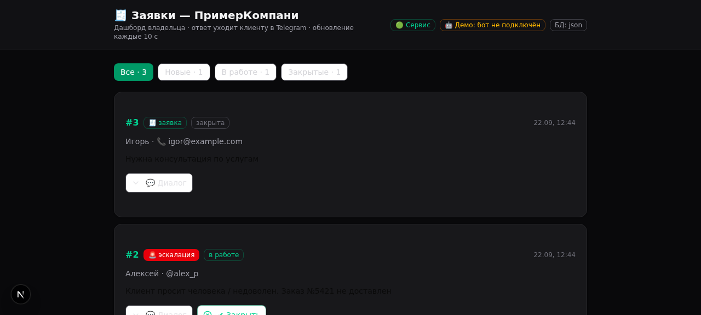
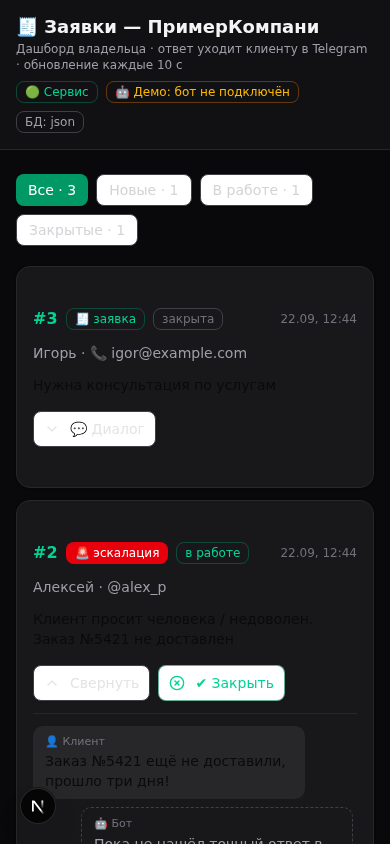

# AI-агент для бизнеса 🤖

Telegram-агент поддержки и продаж: отвечает на вопросы по базе знаний,
квалифицирует лида, собирает заявки, эскалирует сложные диалоги живому
менеджеру и уведомляет владельца. В комплекте мини-дашборд для ответов клиентам.

Проект собран по методике «Project Plan + AGENTS.md»: файл [AGENTS.md](AGENTS.md)
— единственный источник правды для AI-агента (Claude Code / Codex): там роль,
стек, правила разработки и план этапов с чекбоксами. Человек читает README,
агент читает AGENTS.md — и оба одинаково понимают проект.

Работает из коробки без платных API: JSON-хранилище + ответы по базе знаний.
LLM и Postgres/Supabase подключаются опционально через `.env`.



> **Для AI-агентов (Claude Code / Codex):** сначала читайте [AGENTS.md](AGENTS.md) —
> там роль проекта, правила и план этапов.

## Что умеет

| Возможность            | Как работает                                                     |
|------------------------|------------------------------------------------------------------|
| Ответы клиентам        | База знаний `knowledge/*.md` (RAG-lite), опционально LLM         |
| Квалификация           | Интенты: цена / заявка / FAQ / жалоба — на регулярках            |
| Заявки (tickets)       | Контакт + тема + транскрипт диалога в БД                         |
| Передача человеку      | Тикет handoff, бот замолкает, владелец получает уведомление      |
| Дашборд владельца      | Список заявок, диалог, ответ клиенту, закрытие заявки            |
| Память диалогов        | История сообщений в хранилище, учитывается при ответах           |

## Быстрый старт (5 минут)

### Шаг 1. Создайте бота в Telegram
1. Откройте [@BotFather](https://t.me/BotFather) → команда `/newbot`.
2. Придумайте имя и username. Получите **токен** вида `123456:ABC-DEF...`.
3. Узнайте свой Telegram ID у [@userinfobot](https://t.me/userinfobot) — он нужен
   для уведомлений о заявках (**OWNER_TELEGRAM_ID**).

### Шаг 2. Настройте и запустите
```bash
cp .env.example .env      # вставьте BOT_TOKEN и OWNER_TELEGRAM_ID
npm install
npm run doctor            # самопроверка (не обязательно, но полезно)
npm run dev
```
Бот запустится в режиме polling — пишите ему в Telegram, он отвечает.
Дашборд: **http://localhost:3000**

### Шаг 3. Подставьте свой бизнес
Отредактируйте файлы в `knowledge/` — бот отвечает ТОЛЬКО на их основе:
- `about.md` — о компании, контакты, график;
- `faq.md` — частые вопросы и ответы;
- `pricing.md` — услуги и цены.

Каждый раздел `## Заголовок` — отдельный фрагмент поиска. Правки подхватываются
автоматически, перезапуск не нужен.

## Заявки и передача менеджеру

- Клиент пишет «хочу заказать» → бот просит контакт → создаётся заявка,
  владельцу летит уведомление в Telegram.
- Клиент жалуется или зовёт человека → тикет **handoff**, бот молчит в чате.
- Владелец отвечает на дашборде → сообщение уходит клиенту от «менеджера».
- Заявка закрывается → бот снова общается сам.

## Апгрейды (по мере роста)

| Что                      | Как включить                                                        |
|--------------------------|---------------------------------------------------------------------|
| **Supabase/Postgres**    | В `.env` задайте `DATABASE_URL` (таблицы создадутся сами). Схема: `sql/schema.sql` |
| **LLM-ответы**           | В `.env`: `LLM_API_KEY`, `LLM_BASE_URL`, `LLM_MODEL` — любой OpenAI-совместимый API |
| **Деплой на VPS**        | `DEPLOY.md` — Docker или systemd за 3 команды, HTTPS для дашборда, чек-лист |
| Векторный RAG, полный дашборд | См. раздел «Апгрейды» в [AGENTS.md](AGENTS.md) |
| **Мобильный дашборд**    | Адаптивная вёрстка — работает с телефона                           |

<p align="center"></p>

Без ключей и базы всё работает из коробки: JSON-хранилище (`data/db.json`) и
шаблонные ответы по базе знаний.

## Структура проекта

```
AGENTS.md            инструкции для AI-агента (план этапов, правила)
knowledge/           база знаний: about.md, faq.md, pricing.md
docs/                скриншоты дашборда
sql/schema.sql       схема Postgres/Supabase
src/
  index.ts           точка входа
  config.ts          .env-конфиг
  storage/           JSON-фолбэк + Postgres
  kb/search.ts       поиск по базе знаний
  agent/             интенты, мозг, LLM, конвейер
  bot/bot.ts         Telegraf-бот
  dashboard/         мини-дашборд (Express)
scripts/doctor.ts    npm run doctor
```

## Частые проблемы

| Симптом                                  | Решение                                                        |
|------------------------------------------|----------------------------------------------------------------|
| `BOT_TOKEN не задан`                     | Проверьте, что `.env` лежит в корне и там есть BOT_TOKEN       |
| Бот не отвечает                          | Убедитесь, что пишете боту в **личку**, а не в группу          |
| `401 Unauthorized` на дашборде           | Логин любой, пароль — из `DASHBOARD_PASSWORD`                  |
| Уведомления не приходят владельцу        | Сначала напишите своему боту /start — Telegram запрещает ботам писать первыми |
| Не находит ответ в БЗ                    | Проверьте формулировки в `knowledge/*.md` — ключевые слова должны совпадать |

## Безопасность (кратко)

- Секреты только в `.env` (в git не коммитится).
- Дашборд: задайте `DASHBOARD_PASSWORD` перед показом кому-либо.
- Бот не выдаёт служебную информацию и работает только по базе знаний.
- Полный чек-лист — в AGENTS.md, этап 8.
